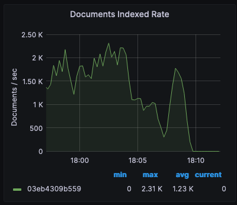
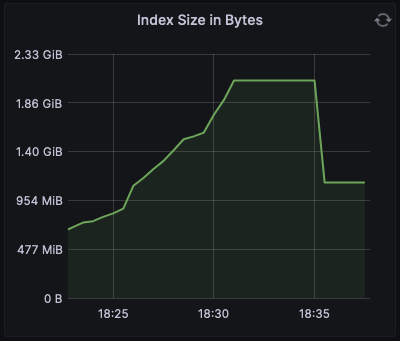
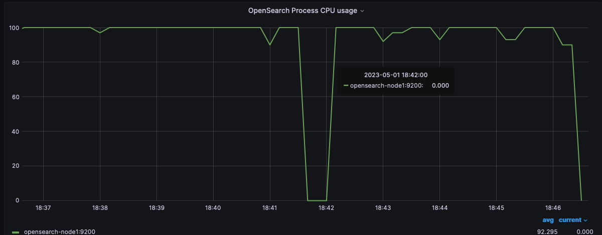

> Level 1: How long did it take to index the 1.2M product data set? What docs/sec indexing rate did you see?

2K docs/sec

> L1: Notice that the Index size rose (roughly doubled) while the content was being indexed, peaked, then ~ 5 minutes after indexing stopped, the index size dropped down substantially. Why did it drop back down? (What did OpenSearch do here?)

> After indexing ended

Opensearch merged the segments

> L1: Looking at the metrics dashboard, what queries/sec rate are you getting?

> L1: What resource(s) appear to be the constraining factor?

CPU Spiked and was hovering at 100%

